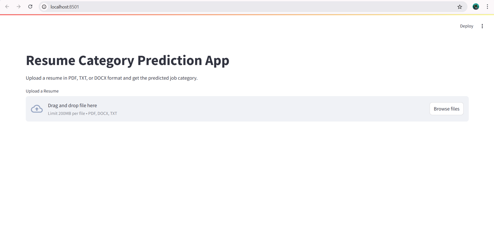
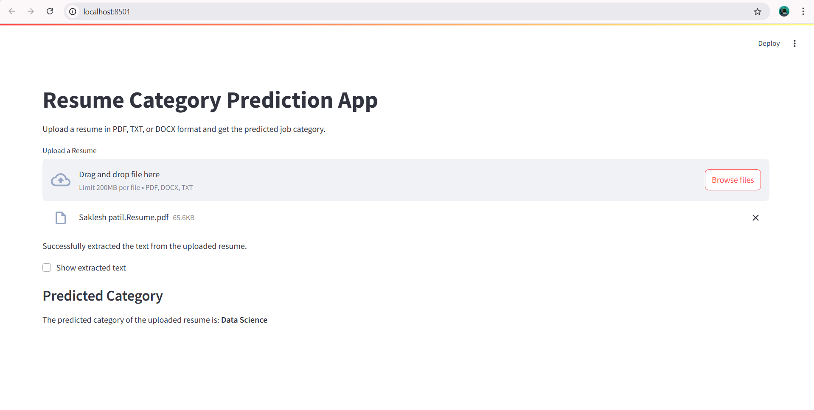
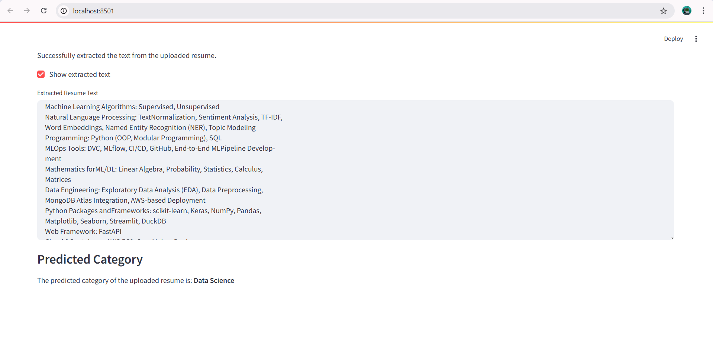

# 🤖 Resume Screener using NLP & Machine Learning

## 📌 Project Overview

This project builds an intelligent **Resume Screening System** using Natural Language Processing (NLP) and multiple machine learning models. It analyzes and classifies resumes based on their content, enabling automated candidate filtering for HR teams or recruitment tools.

---

## 🚀 Features

- ✅ Text processing with **TF-IDF Vectorization**
- ✅ Multi-label classification using:
  - **K-Nearest Neighbors (KNN)**
  - **Support Vector Classifier (SVC)**
  - **Random Forest Classifier**
- ✅ Evaluation with Accuracy, Confusion Matrix & Classification Report

---

## 📂 Project Structure

```
Resume_Screener_NLP/
│
├── data/
│ └── resumesDataSet.csv # Resume dataset (text + labels)
│
├── models/
│ ├── tfidf.pkl
│ ├── encoder.pkl
│ └── clf.pkl
│
├── notebook/
│ └── resume_screener.ipynb # EDA, preprocessing, model training
│
│── app.py  # Streamlit App
│── LICENSE
│── requirements.txt  # Dependencies
└── README.md # Project documentation
```

## 🧠 Machine Learning Models

Three models were trained and evaluated:

1. **K-Nearest Neighbors**
2. **Support Vector Classifier (SVC)**
3. **Random Forest Classifier**

Each model is wrapped with `OneVsRestClassifier` for multi-label classification.

---

## 📊 Model Evaluation

Each model was evaluated using:
- ✅ **Accuracy**
- ✅ **Confusion Matrix**
- ✅ **Classification Report (Precision, Recall, F1-score)**

You can compare these metrics to decide the best performing model for deployment.

## 💡 Future Improvements
- Add deep learning models (e.g., BERT, LSTM) for better text understanding
- Deploy on AWS as an API for real-time screening

Below is a preview of the Streamlit application:



